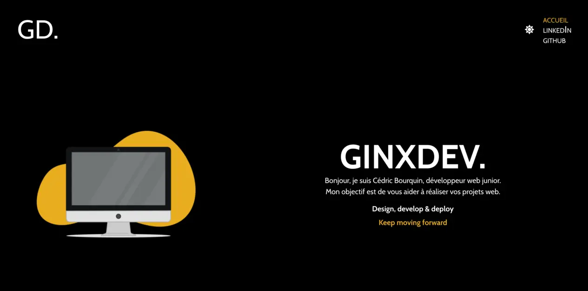
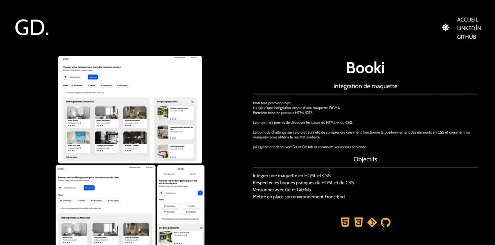

# Mon Portfolio
## 1er projet autonome en REACT avec Vite

Ce projet fait partie du cursus de la formation "Développeur Web" d'Openclassrooms. 


## Screenshots





## Run Locally

Clone the project

```bash
  git clone https://github.com/ginx836/ginxdev-portfolio.git
```

Go to the project directory

```bash
  cd ginxdev-portfolio
```

Install dependencies

```bash
  npm install
```

Start the server

```bash
  npm run start
```


## Environment Variables

To run this project, you will need to add the following environment variables to your .env file

`VITE_EMAIL_JS_PUBLIC_KEY` Définit la clé publique pour Email JS


## Documentation


Ce projet utilise les dépendances suivantes : 

 * React 18.2.0 / Vite 5.0.8
 * [Email JS 3.12.1](https://www.emailjs.com/)
 * [React-Router 6.21.1](https://reactrouter.com/)
 * [React-Icons 5.0.1](https://react-icons.github.io/react-icons/)
 * Eslint
 * Sass 
 * Prettier


## Related

Merci à "Born to Code" pour le tutoriel sur le card Slider 
[Lien Youtube](https://www.youtube.com/watch?v=ywqfSXSbs60)


## License

[MIT](https://choosealicense.com/licenses/mit/)

